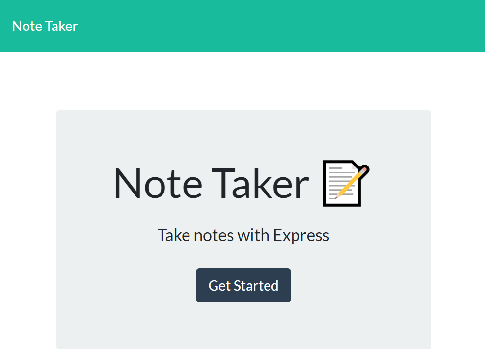
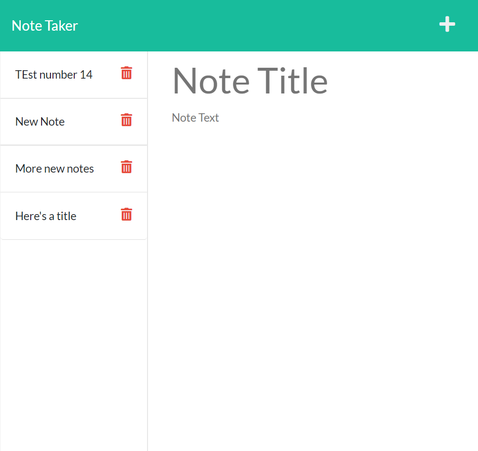

# DU-HW11-Express-Note-Taker

DU Coding Bootcamp Homework 10: Team Profile Generator

# html / node.js application
This is an **html** fronted **node.js** application using **express** web application framework that will access and update a "db.json" file on the local filesystem of the server in the **./db directory**.

Live Heroku App <https://mighty-cliffs-43274.herokuapp.com/>

Github Repository Address: <https://github.com/GittinIt6/DU-HW11-Express-Note-Taker>

## Purpose

This application is specific to anyone that wants to generate a list of tasks with descriptions.

## Audience

The intended audience is an individual that wants to generate a list of tasks with descriptions.

&#x2612; **USER** Technical Knowledge:
The user of this site does **_not_** need to have a technical background.

&#x2611; **Developer** Technical Knowledge:
A developer editing this code does need to have a technical background, and requires an understanding of node.js.

## Instructions for developers
1. Ensure you have downloaded and installed node.js and express and have rebooted your system (if Windows)
2. Clone repository to your system.
3. From a terminal, ensure you are in the server.js directory
4. Run:
~~~
npm i
npm start
~~~
5. Tasks are saved in a JSON file (acting as a database) in the **./db** directory

## API
| Path       | Method | Action                | Requires   |
|------------|--------|-----------------------|------------|
| *          | GET    | return index.html     |            |
| /notes     | GET    | return notes.html     |            |
| /api/notes | GET    | return db.json        |            |
| /api/notes | POST   | adds content db.json  | title,text |
| /api/notes | DELETE | deletes specific item | :id        |

## Technical Detail

This application uses node.js and **express** with **fs** and **path**.

The application files are designed to be configured as follows:
```
Root Directory/
|
│ --server.js
│ --package.json
│ --.gitignore
│ --readme.md
|
└───db/ (folder)
│   ├── Employee.test.js
│   ├── Engineer.test.js
│   ├── Intern.test.js
│   └── Manager.test.js
└───public/ (folder)
│   ├── assets/ (folder)
│   │   ├── css/ (folder)
│   │   └── js/ (folder)
│   ├── index.html
│   └── notes.html
└───routes/ (folder)
```
>**node.js**: This site uses node.js <https://nodejs.org/>

>**express**: This site uses express <https://expressjs.com/>

>**fs**: This site uses node.js built in fs module <https://nodejs.dev/learn/the-nodejs-fs-module>

>**path**: This site uses the node.js built in path module <https://nodejs.dev/learn/the-nodejs-path-module>

### Data Flow Diagram:




## Revision History 

1. This application was created in March 2022 as part of a bootcamp assignment. It was created using starter code provided by the instructor.
